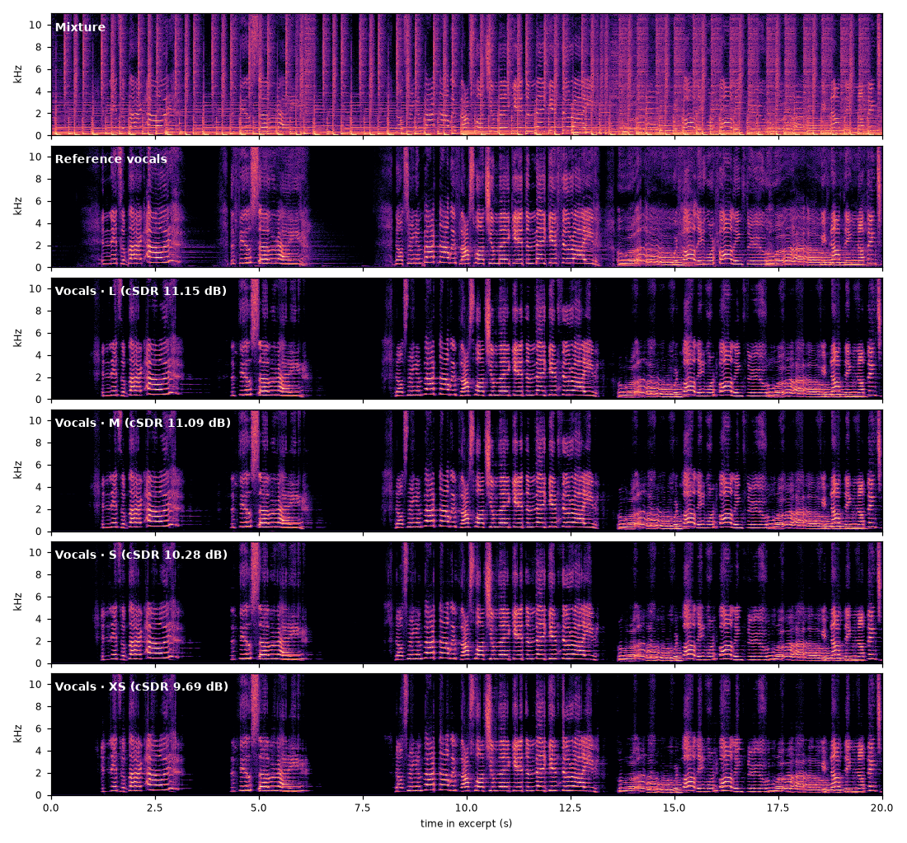
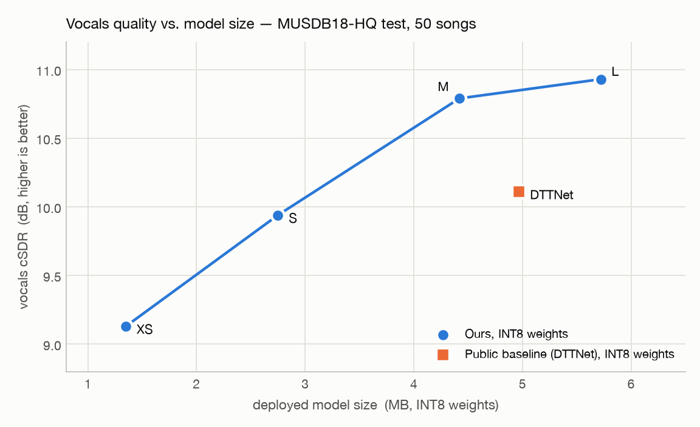
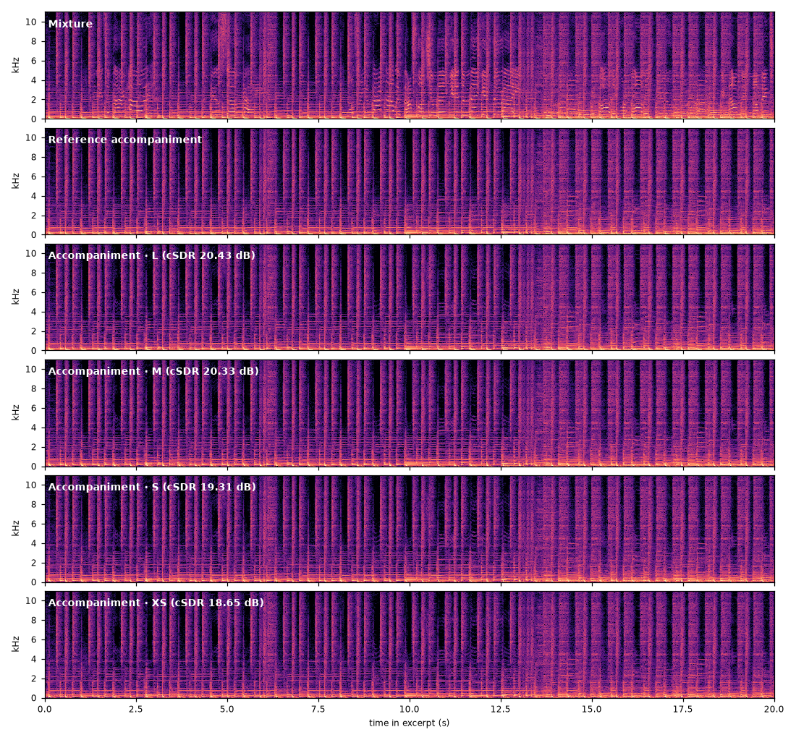
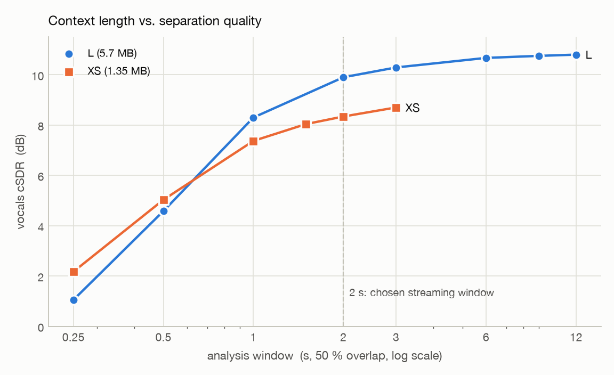

# Lightweight Music Source Separation — Results

Neural **vocals / accompaniment separation** for 44.1 kHz stereo music, built
as a family of four model sizes (**1.35 – 5.7 MB** deployed) for offline and
streaming use. The full-size model reaches **10.93 dB vocals cSDR** on the
MUSDB18-HQ test set with INT8 weights; the smallest keeps **9.13 dB** at under
a quarter of the size and a fifth of the compute.

**This repository publishes results, not code.** It contains objective scores,
compute and footprint figures, spectrograms and before/after audio. The
implementation, model weights, training pipeline and tooling are proprietary
and not included.

## What it does

```
44.1 kHz stereo mixture ──► complex STFT
     ──► convolutional encoder–decoder with a transformer bottleneck
     ──► vocals spectrogram (generated directly, no mask) ──► inverse STFT ──► vocals
     mixture − vocals ──► accompaniment
```

- **One model, two stems**: accompaniment is the mixture minus the separated
  vocals. This scores higher than a dedicated accompaniment model, and only one
  set of weights has to be stored (see [Accompaniment](#accompaniment)).
- **Four sizes, one recipe**: L, M, S and XS differ only in depth (number of
  bottleneck blocks) and channel width. The smaller three are distilled from L.
- **INT8 weights**: per-channel symmetric weight-only quantisation costs
  at most 0.02 dB across all four sizes.
- **Offline and streaming modes**: offline uses 12 s windows with 75 % overlap.
  Streaming uses 2 – 3 s windows and emits audio every 0.5 – 1 s. The
  trade-off between window length, overlap, quality and compute is measured
  below.

## Listen

**▶ [Listening page](https://r7788380.github.io/music-separation-sdk-results/)** —
every clip below with an in-browser player, per-clip scores and spectrograms.

A 20 s excerpt (1:35 – 1:55) of *Juliet's Rescue – Heartbeats* from the
MUSDB18-HQ **test** set, which was never used in training. It is provided as the
mixture, the reference stems, and the vocals and accompaniment from all four
INT8 models (`listening/{mixture,vocals_ref,accomp_ref,vocals_<size>,accomp_<size>}.wav`,
44.1 kHz stereo).

| Size | Vocals cSDR (full song) | Accompaniment cSDR (full song) |
|---|---|---|
| Mixture used as-is | – | 6.53 |
| L | 11.15 | 20.43 |
| M | 11.09 | 20.33 |
| S | 10.28 | 19.31 |
| XS | 9.69 | 18.65 |



## Objective evaluation

**Test set**: MUSDB18-HQ, all 50 test songs, 44.1 kHz stereo.
**Metric**: cSDR. The SDR of each 1 s chunk is computed as an energy ratio, and
the median is taken over all chunks pooled across the 50 songs. This is the
"chunk-level SDR" convention used in the recent MUSDB literature.
**Inference**: offline, 12 s windows with 75 % overlap.

| Size | Params | GMACs per 2 s of audio | Size FP32 | Size INT8 | Vocals cSDR FP32 | Vocals cSDR **INT8** |
|---|---|---|---|---|---|---|
| **L** | ≈ 5.5 M | 38.8 | 21.8 MB | 5.72 MB | 10.95 | **10.93** |
| **M** | ≈ 4.2 M | 31.6 | 16.7 MB | 4.42 MB | 10.81 | **10.79** |
| **S** | ≈ 2.6 M | 16.2 | 10.2 MB | 2.75 MB | 9.95 | **9.94** |
| **XS** | ≈ 1.2 M | 7.16 | 4.9 MB | 1.35 MB | 9.13 | **9.13** |
| Public baseline: DTTNet, official weights, re-scored with our pipeline | ≈ 5.0 M | – | 19.95 MB | 4.97 MB | 10.13 | 10.11 |



For context, these are published vocals cSDR scores for well-known separators
on the same test set. They are taken from each model's publication and were not
re-measured by us.

| Model | Vocals cSDR | Training data |
|---|---|---|
| Open-Unmix | 6.3 | MUSDB18 |
| Spleeter | 6.9 | private |
| BSRNN | 10.0 | MUSDB18 |
| BS-RoFormer | 12.5 – 13 | large private set, models of several hundred MB |
| **Ours, L, INT8** | **10.93** | MUSDB18-HQ + a public multitrack corpus |
| **Ours, XS, INT8** | **9.13** | same |

### How the smaller sizes were built

| Size | Change from L | Training | Δ cSDR vs. L |
|---|---|---|---|
| M | 5 → 3 bottleneck blocks | the 3 kept blocks warm-started from L; distillation from L | −0.14 |
| S | width × 0.57, 6 bottleneck blocks | two-stage from scratch; distillation from L | −1.00 |
| XS | width × 0.43, 3 bottleneck blocks | two-stage from scratch; distillation from L | −1.82 |

- **Depth is cheap, width is not.** Removing two of the five bottleneck blocks
  cuts 23 % of the parameters for 0.14 dB. Narrowing the network costs about
  five times as much quality per parameter removed.
- **Two-stage training for the small models.** In stage 1 the model starts
  from zero and is trained on 6 s chunks with an L1 loss against the
  reference plus an L1 distillation loss, without remixing. In stage 2 the
  stage-1 weights are fine-tuned with the full recipe: 9 s chunks, the
  multi-resolution complex-spectrum loss, cross-song remixing and
  augmentation. Training from zero with the full recipe collapses to
  silence, because direct spectrogram generation sits in a "predict nothing"
  minimum and the multi-resolution loss deepens it.
- **Quantisation loss shrinks with model size**: L −0.017 dB, M −0.016, S −0.004,
  XS +0.007 (noise-level).

## Accompaniment

Scored against the sum of the drums, bass and other stems on all 50 test songs,
using the same backbone at the stage before extra training data was added.

| Accompaniment estimate | cSDR |
|---|---|
| Mixture used as-is (floor) | 7.35 |
| Mixture − DTTNet vocals (public weights) | 19.14 |
| Dedicated accompaniment model, same backbone and recipe | 18.05 |
| Mixture − our vocals, final L, FP32 / INT8 | **20.04 / 20.01** |

The dedicated model converged normally and still scored lower.
Accompaniment is the high-energy, complex part of the mix, so reconstructing it
directly produces more error than subtracting a small vocal estimate. The
deployed design therefore uses a single vocals model with two outputs.



## Streaming

Streaming processes a sliding window and emits one hop at a time. The
algorithmic latency is the hop plus the look-ahead. Shorter windows give the
network less musical context:



| Window (50 % overlap) | L cSDR | L GMAC/s | XS cSDR | XS GMAC/s |
|---|---|---|---|---|
| 0.25 s | 1.05 | 56.4 | 2.17 | 10.4 |
| 0.5 s | 4.58 | 42.3 | 5.03 | 7.8 |
| 1 s | 8.30 | 42.3 | 7.37 | 7.8 |
| **2 s** | **9.90** | 38.8 | **8.34** | 7.2 |
| 3 s | 10.29 | 40.0 | 8.70 | 7.4 |
| 12 s | 10.80 | 38.2 | – | – |

- **Shortening the window does not lower compute per second.** At a fixed
  50 % overlap the compute stays at 38 – 42 GMAC/s for L and 7 – 8 GMAC/s for XS.
  Below 0.5 s it even rises, because frames are padded to a fixed multiple.
  A shorter window reduces latency and peak memory, not compute. Compute is
  driven by the **overlap** and the **model size**.
- **2 s is the knee.** Going from 2 s to 3 s adds only 0.34 – 0.39 dB. Below 1 s
  quality falls off steeply.
- **Smaller models need more context.** XS loses quality faster than L as the
  window shrinks.

Overlap at a 2 s window, size L:

| Overlap | Hop | Vocals cSDR | GMAC/s |
|---|---|---|---|
| 50 % | 1.0 s | 9.90 | 38.8 |
| **25 %** | 1.5 s | **9.76** (−0.14) | **25.9** |
| 10 % | 1.8 s | 9.61 (−0.29) | 21.5 |
| 0 % | 2.0 s | 3.92 ✖ | 19.4 |

At 25 % overlap, compute drops by a third and quality by only 0.14 dB. At 0 %
the window edges, where separation is weakest, are exposed at full weight, so
10 % is the practical minimum. For XS at a 2 s window with 25 % overlap, the
load is **4.8 GMAC/s**.

End-to-end streaming results on the 50-song test set, with a 0.5 s hop and
0.5 s look-ahead (**1 s algorithmic latency**):

| Configuration | Vocals cSDR | Accompaniment cSDR |
|---|---|---|
| L, 3 s window, FP32 | 10.31 | 19.58 |
| L, 2 s window, FP32 | 9.81 | 19.16 |
| L, 2 s window, INT8 | 9.81 | 19.16 |

## Embedded C build

A framework-free C build of the S and XS sizes with INT8 weights, measured for
streaming with a 2 s window and 1 s hop:

| | S | XS |
|---|---|---|
| Compute (M instructions / s) | 31,500 | 14,400 |
| Flash: code | 111 KB | 111 KB |
| Flash: weights + layout table | 2,767 KB | 1,383 KB |
| Library static RAM | 0.2 KB | 0.2 KB |
| Instance RAM, of which activations | 24,100 KB / 21,126 KB | 18,822 KB / 15,966 KB |
| **Total (Flash + RAM)** | **27.0 MB** | **20.3 MB** |

With a 1 s window, XS needs 11.3 MB of instance RAM (12.8 MB in total).
**Memory, not compute, is the binding constraint.** The weights already fit in
1.4 MB, but the activations of a 2 s stereo window take about 85 % of the RAM.
Getting XS onto a few-megabyte DSP therefore depends on tiling the activations
along the time axis rather than on shrinking the model further.

## License

Sample audio, figures and evaluation results are provided for **evaluation
only**; see [`LICENSE`](LICENSE).

Music excerpt: *Juliet's Rescue – Heartbeats*, from the MUSDB18-HQ test set
(Z. Rafii, A. Liutkus, F.-R. Stöter, S. I. Mimilakis, R. Bittner, 2019,
doi:10.5281/zenodo.3338373). It is used here for non-commercial research
demonstration only, and all rights remain with the original artists.
